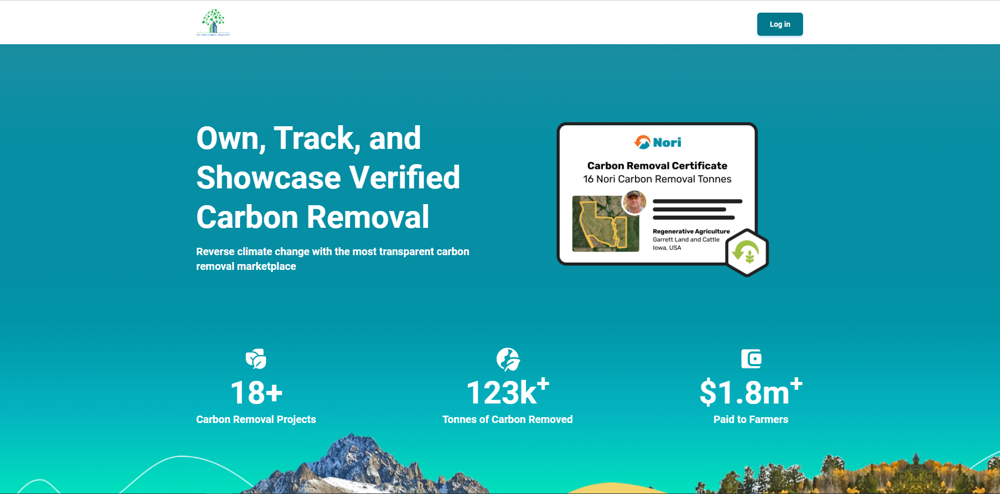

# Netzero (frontend)

## Live site

## Contact info
- **Email:** dejanteofilovic2@gmail.com
- **Discord:** [dejan_teofilovic](https://discord.gg/PztT2r5U)

## Release date
Mar 22, 2023

## Environment
- `Node.js v18.12.1`

## Stack
- **Framework:** `React.js v18.2.0`
- **Theme:** `Material-Tailwind v1.4.2`

## How to run the project.
1. Please open terminal window in the root directory.
2. Please run command `npm run dev` in it.

3. You can see a site like the following image if it is run correctly.

